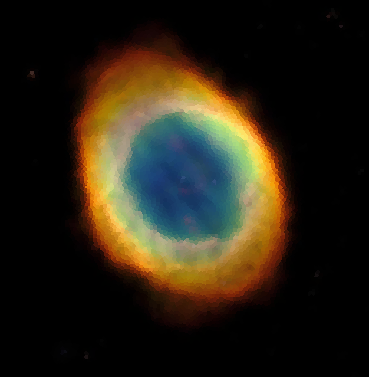
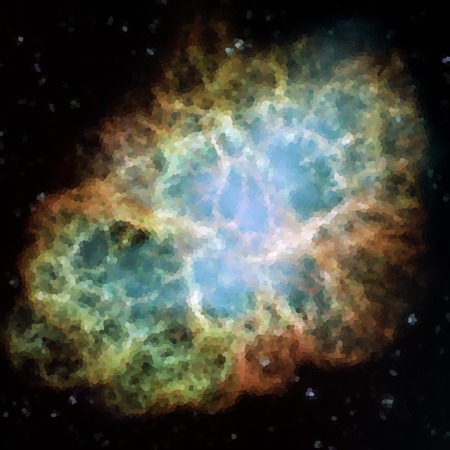
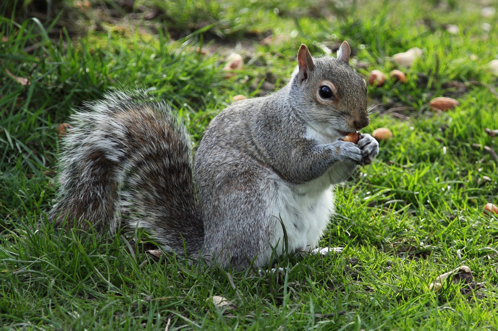
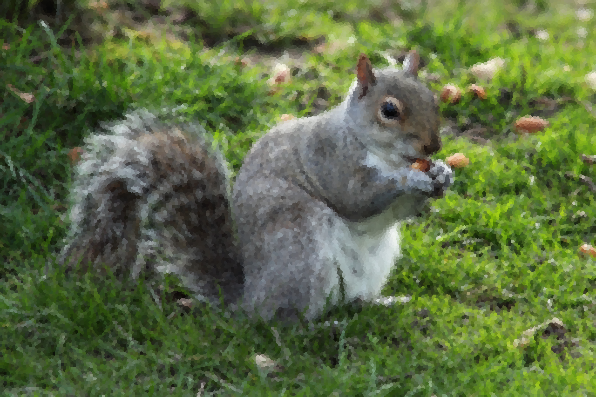

# cuMosaic <!-- omit in toc -->

A CUDA-accelerated Voronoi diagram generator to apply a Mosaic filter on large images to make them prettier.

- [Sample Images](#sample-images)
- [Description](#description)
- [How to Run](#how-to-run)
  - [Options](#options)
- [Features Planned](#features-planned)

## Sample Images

> Note - it is recommended to click on the output images to better see what changed.

| Input Image | Output Image| Link to Original |
|:-----:|:------:|:------:|
|   |    |  [Ring Nebula](https://images.nasa.gov/details-GSFC_20171208_Archive_e001465)  |
|   |    |  [Crab Nebula](https://images.nasa.gov/details-PIA03606)  |
|   |  |  [Squirrel Eating](https://www.publicdomainpictures.net/en/view-image.php?image=6221&picture=squirrel-eating)  |

## Description

This project creates Voronoi diagrams ([Wikipedia article](https://en.wikipedia.org/wiki/Voronoi_diagram)) on top of an image with seeds placed throughout the image using [Fast Poisson Disk Sampling](https://www.cct.lsu.edu/~fharhad/ganbatte/siggraph2007/CD2/content/sketches/0250.pdf).

Doing this allows for seeds (the "center" point of a Voronoi cell) to be randomly, yet uniformly placed throughout the image.
Then each pixel within the image is evaluated to find the closest seed to it using the Euclidiean Distance formula.
Upon finding the closest seed, the pixel is assigned the color of its closest seed, this color is the mean color value of a small box of pixels centered on the seed.
Iterating through the pixels is CUDA-accelerated, where the image is processed in parallel in small chunks. This allows for the mosaicing to be relatively performant on extremely large images.

The outputted image will then appeared to have a mosaic pattern applied to it.

## How to Run

- Prerequisites
  - Windows 10
    - Sorry this isn't cross-platform
  - Have a CUDA-compatible GPU installed
    - Needs to be [Compute Capability](https://en.wikipedia.org/wiki/CUDA#GPUs_supported) of at least 3.5
  - Version 11.0 of the [CUDA Toolkit](https://developer.nvidia.com/cuda-toolkit)
  - Visual Studio 2019 with C++ module and CUDA-support.

> Note: If the GPU doesn't have sufficient memory (based on image size) then you'll run into some issues.

1. Clone this repository
2. Open the `cuMosaic.sln` in Visual Studio
3. Attempt to do a Rebuild all for the solution
   1. There may be differences here if default CUDA installation paths differ, edit these in the `cuMosaic` project properties.
4. Set command arguments in `cuMosaic` project
5. Run

### Options

| Option | Value Type | Description |
|-|:-:|-|
| -h/--help | N/A | Displays the usage message. |
| -i/--input | `string` | Path to the input image, encoded in binary PPM format. Example: "imgs\input.ppm" |
| -o/--output | `string`| Path of the output image, will be encoded in binary PPM format. Example: "imgs\output.ppm" |
| -d/--distance | `float` | The minimum distance between the center point of any Voronoi cell. Note this is roughly in pixels. Smaller numbers produce more cells and take longer to process. |

## Features Planned

- Accept common image formats for input and output.
  - Currently, only binary-encoded PPM images (preferrably exported with GIMP) are supported.
- Add in anti-aliasing.
- Create a simple graphical user interface alongside the console application for ease of use.
- Allow for an option for spacing between each cell to create a more standard "mosaic" look and feel.
  - Typically, mosaics have some form of spacing between each cell, we do not have that here - more of a preference decision.
- Allow for different distance functions to see what other types of creations can be made.
- I think being able to visually see the program mosaicing an image live would be really neat, but that seems like a large stretch goal.
- Batching for large images on smaller GPUs due to GPU memory constraints.